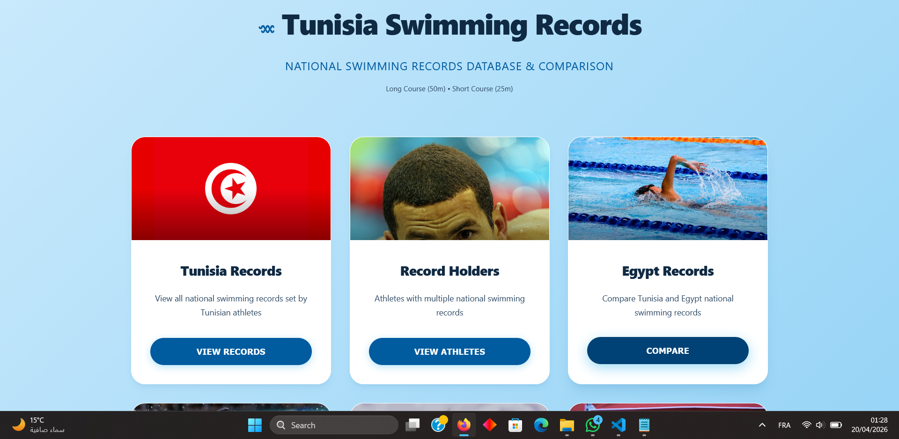
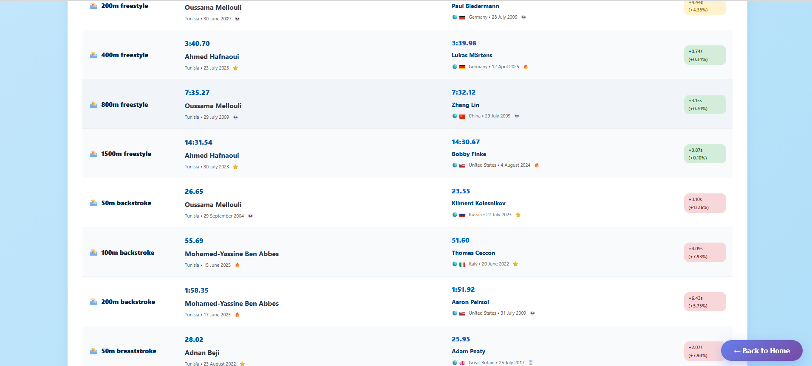
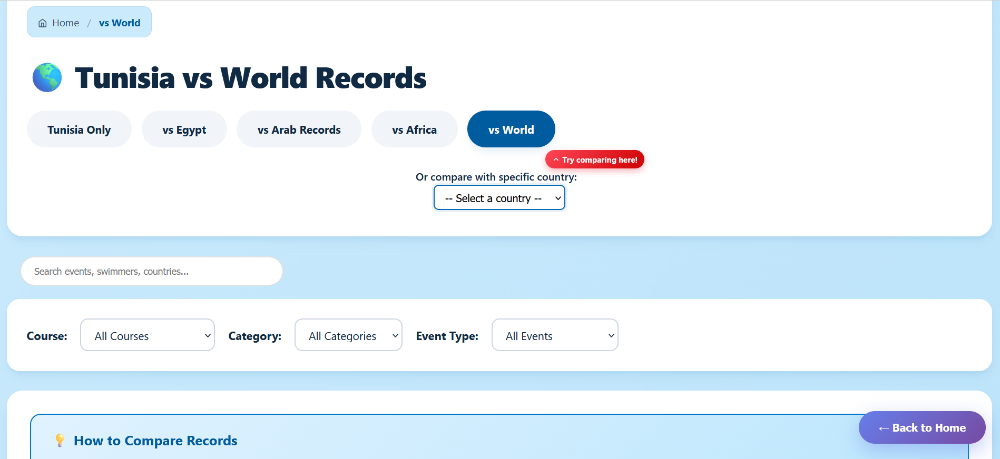

# 🏊 Tunisia Swimming Records

A web app to compare Tunisia's swimming records with Egypt, Arab countries, Africa, and world records.

## Screenshots


*Browse swimming records with an elegant, water-inspired interface*


*Compare Tunisia's records with other countries - gap analysis included*


*Dynamic country selector with 22+ nations*

## Quick Start

```bash
python start_server.py
```

Open `http://localhost:8000/src/index.html` in your browser.

## Features

- Compare Tunisia's records with 22+ countries
- Search and filter by event, course type, or category
- Gap analysis showing time differences and percentages
- Auto-detects new countries when you add JSON files to `data/arab_countries/`

## Update Records

```bash
cd scripts
python scrape_records.py
```

## Tech Stack

Vanilla JavaScript, Python web scraping, Wikipedia data source.

## Contributing

Pull requests welcome! Data files are in JSON format under `/data`.

---

Built for the Tunisian swimming community 🇹🇳
